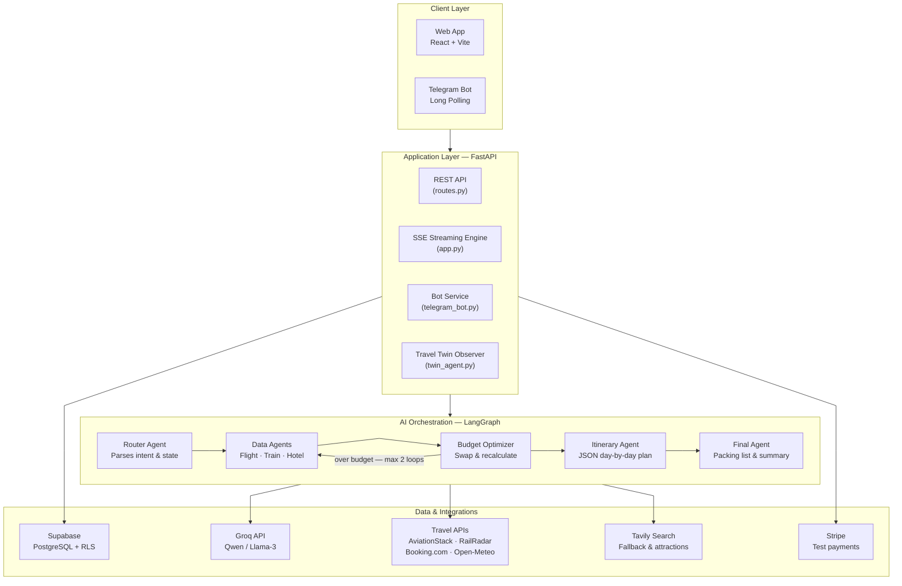
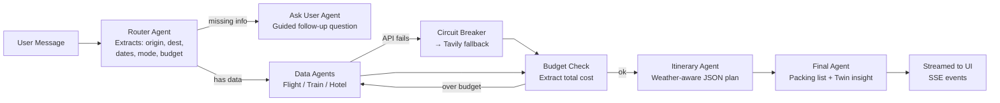
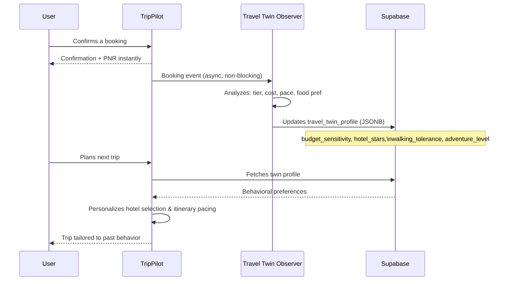

<div align="center">
  
  <br/><br/>
  <p>
    
    
    
    
   
  </p>
  <h3>The AI-powered travel concierge that plans, books, and manages your entire trip through natural conversation.</h3>
  <p><strong><a href="https://trip-pilot-twin.vercel.app">🚀 Live Demo →</a></strong></p>
</div>

---

## What is TripPilot?

TripPilot is a **multi-agent AI travel planning platform** that converts a single conversational message into a fully planned, bookable trip — complete with flight/train/hotel search, a day-by-day visual itinerary, a weather-aware packing checklist, and a personalization engine that learns your travel preferences over time.

Unlike a basic chatbot wrapper, TripPilot is built as a complete product with:
- **Real streaming AI responses** (Server-Sent Events, not polling)
- **A guided, step-by-step booking wizard** with simulated Stripe payments
- **A Telegram companion bot** for on-the-go trip management
- **A Travel Twin AI** that learns your preferences from every booking
- **Interactive expense tracking** and auto-generated PDF trip reports

---

## System Architecture



---

## Multi-Agent Planning Pipeline



Every user request is decomposed by the **Router Agent** into a structured state object and routed to specialized agents. The pipeline is **cyclic**: if the proposed trip exceeds the user's budget, the Budget Optimizer loops back to swap transport or downgrade hotel tier before presenting results.

---

## Travel Twin — AI Personalization

TripPilot learns from every booking you make. After each confirmed trip, a background AI observer analyzes your choices and updates a persistent behavioral profile:



The Twin profile is injected into every LangGraph session as context, so every recommendation gets measurably better over time.

---

## Safety: Emergency SOS

A dedicated safety flow is built directly into the Telegram companion, designed for travelers in unfamiliar locations:

1. **SOS Trigger:** The traveler taps a single SOS button in Telegram.
2. **Safety Check-in:** TripPilot asks for a check-in within a short countdown window and provides a one-tap live location sharing link.
3. **Auto-Alert (Fast2SMS):** If the check-in isn't received in time, the system automatically notifies the traveler's saved emergency contact by SMS with their live location and current trip details.

---

## Tech Stack

| Layer | Technology | Notes |
|---|---|---|
| Frontend | React 18, Vite | Glassmorphism dark UI, Framer Motion |
| Backend | FastAPI (Python 3.10+) | Async SSE streaming, threadpool for sync DB calls |
| AI Orchestration | LangChain, LangGraph | Cyclic multi-agent pipeline |
| LLM | Groq — Qwen-3 / Llama-3 | Fast inference, structured JSON output |
| Database & Auth | Supabase (PostgreSQL, RLS) | Security-definer RPCs for bot access |
| Payments | Stripe (test mode) | PaymentIntent flow with 15-digit PNR |
| Messaging | Telegram Bot API | Long polling, deep-link QR pairing |
| Search Fallback | Tavily | Used when travel APIs are unavailable |

---

## Project Structure

```
Trip-Pilot/
├── .env                          # All API keys and configuration
├── documentation.txt             # Full technical reference (start here)
│
├── backend/
│   ├── app.py                    # FastAPI entrypoint, SSE streaming, lifespan hooks
│   ├── routes.py                 # REST: profile, bookings, trips, telegram, weather
│   ├── config.py                 # Centralized env var loading
│   ├── llm_factory.py            # LLM provider abstraction (Groq default)
│   ├── circuit_breaker.py        # 3-state circuit breaker for all external APIs
│   ├── stripe_service.py         # Stripe PaymentIntent creation
│   ├── telegram_bot.py           # Full Telegram bot state machine
│   ├── twin_agent.py             # Background Travel Twin AI observer
│   ├── pdf_report.py             # Dynamic PDF trip expense report (ReportLab)
│   ├── supabase_migrations.sql   # Full DB schema, RLS policies, SECURITY DEFINER RPCs
│   ├── requirements.txt
│   ├── agents/
│   │   ├── nodes.py              # All LangGraph agent logic and LLM prompts
│   │   ├── graph.py              # Graph assembly: nodes, edges, cyclic routing
│   │   └── state.py              # TravelState TypedDict
│   └── tools/
│       ├── flight_tool.py        # AviationStack API
│       ├── train_tool.py         # RailRadar API
│       ├── hotel_tool.py         # Booking.com via RapidAPI
│       ├── weather_tool.py       # Open-Meteo (free)
│       └── tavily_tool.py        # Tavily web search fallback
│
└── frontend/
    └── src/
        ├── pages/
        │   ├── LandingPage.jsx   # Animated landing page
        │   ├── AuthPage.jsx      # Auth (email + OAuth)
        │   └── ChatPage.jsx      # Main chat: SSE stream, booking, history
        └── components/
            ├── ItineraryCard.jsx # Animated day-by-day visual cards
            ├── FinalPlanCard.jsx # Sectioned trip summary (collapsible)
            ├── ResultCards.jsx   # Flight / Train / Hotel result cards
            ├── BookingModal.jsx  # 3-step booking wizard
            ├── ProfileModal.jsx  # Profile editor + Travel Twin dashboard
            └── TravelWidget.jsx  # Quick-search form → natural language prompt
```

---

## Setup & Installation

### Prerequisites
- Node.js 18+, Python 3.10+
- A Supabase project (PostgreSQL + Auth enabled)
- API keys: Groq, AviationStack, RailRadar, Tavily, Booking.com (RapidAPI), Telegram Bot, Stripe

### 1. Clone the repository

```bash
git clone https://github.com/Abhishekmnnit6022/Trip-Pilot.git
cd Trip-Pilot
```

### 2. Backend setup

```bash
python -m venv langgraph_env3
source langgraph_env3/Scripts/activate   # Windows: langgraph_env3\Scripts\activate
pip install -r backend/requirements.txt
```

Create a `.env` file in the project root:

```env
# LLM Provider Configuration
# Supported options: groq, openai, anthropic, gemini, openrouter, ollama
LLM_PROVIDER=groq

# Only set the API key for the provider you chose above:
GROQ_API_KEY=your_groq_key
OPENAI_API_KEY=your_openai_key
ANTHROPIC_API_KEY=your_anthropic_key
GEMINI_API_KEY=your_gemini_key
OPENROUTER_API_KEY=your_openrouter_key

# Travel APIs
AVIATIONSTACK_API_KEY=your_key
TAVILY_API_KEY=your_key
RAPIDAPI=your_rapidapi_key
RAILRADAR_API_KEY=your_key

# Supabase
SUPABASE_URL=https://xxx.supabase.co
SUPABASE_ANON_KEY=your_anon_key
SUPABASE_DB_URL=postgresql://...

# Telegram
TELEGRAM_BOT_TOKEN=your_bot_token

# Stripe
STRIPE_SECRET_KEY=sk_test_...

# Emergency SOS (Optional)
FAST2SMSAPIKEY=your_fast2sms_key
```

Apply the database schema (Supabase SQL Editor):
```bash
# Copy contents of backend/supabase_migrations.sql and run in Supabase SQL editor
```

Start the backend:
```bash
uvicorn backend.app:app --reload
```

### 3. Frontend setup

```bash
cd frontend
npm install
```

Create `frontend/.env`:
```env
VITE_API_BASE_URL=http://localhost:8000
VITE_SUPABASE_URL=https://xxx.supabase.co
VITE_SUPABASE_ANON_KEY=your_anon_key
```

Start the frontend:
```bash
npm run dev
```

The app will be available at `http://localhost:5173`.

### 4. Telegram Bot

- Create a bot via [@BotFather](https://t.me/BotFather)
- Set `TELEGRAM_BOT_TOKEN` in your `.env`
- The bot's polling loop starts automatically with the backend — no separate process needed
- Use the QR code in the chat sidebar to link your web account to Telegram

---

## Example Prompts

The system handles full natural-language travel requests:

```
"Book a train from Lucknow to Haridwar on 15 Sep for 2 people, budget ₹5000"
```
```
"Find flights from Delhi to Goa next Friday, I prefer morning departures"
```
```
"Plan a 3-day spiritual trip to Rishikesh starting 20 Sep, budget ₹15000"
```

---

## Design Philosophy

- **Streaming-first** — every AI response is streamed token-by-token via SSE. Users see the agent working live, not a loading spinner.
- **Resilience** — circuit breakers wrap every third-party integration. If AviationStack is down, Tavily search takes over automatically.
- **Guided, not open-ended** — the Router Agent asks one focused question at a time, building up a complete trip state before triggering searches. This prevents the common AI travel app failure of "no results because the user didn't specify dates."
- **Think-block-aware parsing** — Qwen's chain-of-thought `<think>` tokens are stripped before JSON extraction, making the pipeline robust across model variants.
- **Real product, not a demo** — persistent profiles, real payment flow, Telegram omnichannel, background personalization, and PDF reports make this production-grade.

---

## Author

**Abhishek Rastogi**  
abhishekrastogi151@gmail.com  
[GitHub →](https://github.com/Abhishekmnnit6022)