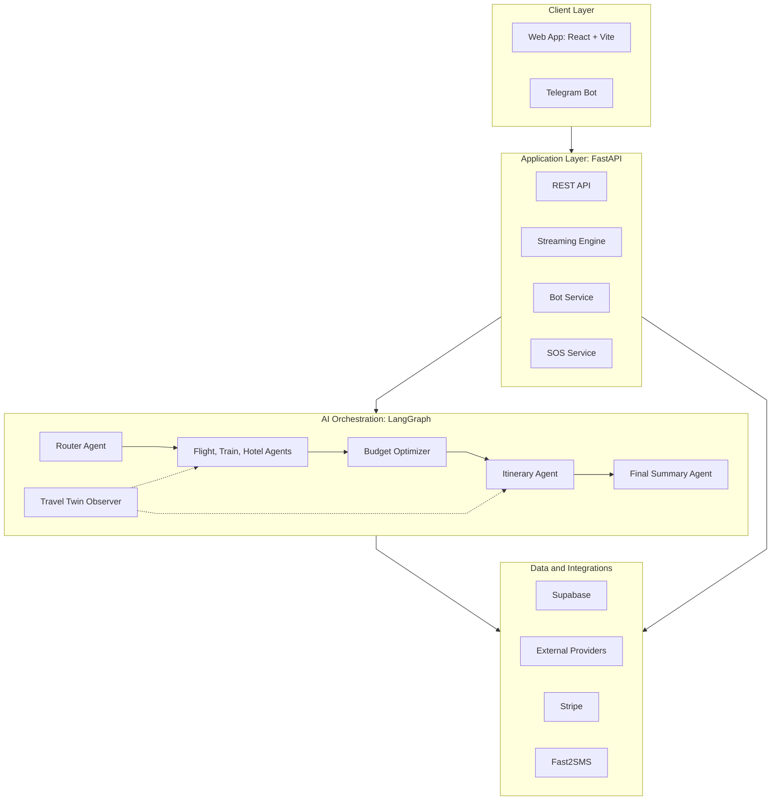
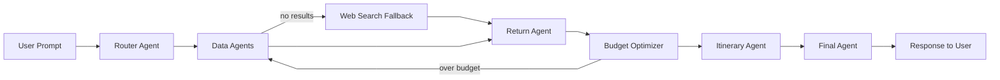
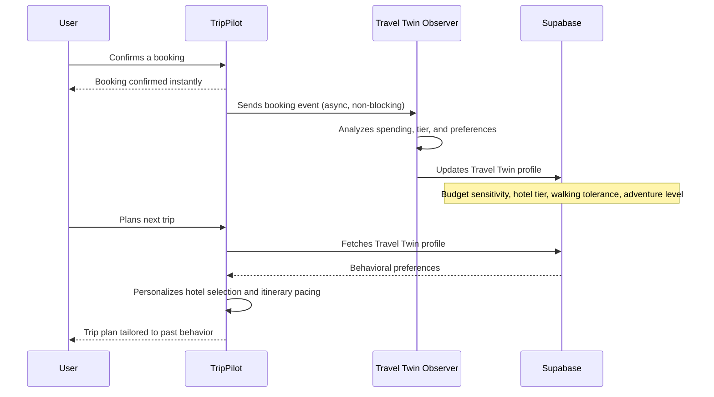

# TripPilot

**An omnichannel, AI-driven travel planning platform that plans, books, and manages entire trips through natural conversation — on the web and on Telegram.**

<p>
  
  
  
  
</p>

**[Live Demo →](https://trip-pilot-twin.vercel.app)**

---

## Overview

TripPilot is a multi-agent AI travel assistant that turns a single conversational prompt into a complete, bookable trip — flights, trains, hotels, a day-by-day itinerary, a weather-aware packing list, and live expense tracking, all coordinated by a graph of specialized AI agents.

Unlike a typical chatbot wrapper, TripPilot is built as a full product: it has persistent user profiles, a real payment flow, a Telegram companion bot for on-the-go trip management, an emergency SOS system, and a personalization engine that learns each traveler's preferences over time.

---

## Highlights

### Core Capabilities

- **Conversational trip planning.** A single natural-language prompt is decomposed by a router agent and handed off to specialized flight, train, and hotel agents, which return live, structured data that is assembled into a coherent, day-by-day itinerary rather than a generic text response.
- **Weather-aware itineraries.** Live forecasts inform both the pacing of the day-by-day plan and an automatically generated packing checklist tailored to predicted temperature and rainfall.
- **End-to-end booking flow.** A guided, three-step wizard — review, payment, confirmation — is backed by real Stripe test-mode transactions, generating a genuine PNR rather than a simulated placeholder.
- **On-trip expense companion.** An interactive itinerary checklist inside Telegram logs expenses automatically as activities are completed, culminating in a dynamically generated PDF trip report at the end of the journey.
- **Polished, app-like interface.** A glassmorphism-based dark UI with a fully responsive, drawer-style mobile experience, built to feel native rather than templated.

### What Sets TripPilot Apart

Most AI travel-planning projects stop at "prompt in, itinerary text out." TripPilot goes further:

- **Adaptive personalization.** A background Travel Twin observer learns each user's budget sensitivity, hotel preference, and travel pace from past bookings, and feeds it straight back into future recommendations — a continuous-learning loop most similar projects skip entirely.
- **True omnichannel continuity.** Web and Telegram share one account, one booking history, and one AI context, with secure multi-device linking — not a bot bolted on as an afterthought.
- **A budget optimizer that negotiates.** If a trip goes over budget, the pipeline automatically swaps transport and hotel tiers instead of simply failing.
- **Safety as a first-class feature.** A one-tap SOS system shares live location and auto-alerts an emergency contact if the traveler doesn't check in — a real-world safety net rarely found in travel-planning demos.

---

## System Architecture



---

## Multi-Agent Planning Pipeline

Every trip request flows through a graph of purpose-built agents rather than a single monolithic prompt:



The pipeline is cyclic rather than linear: if a proposed trip exceeds the user's budget, the **Budget Optimizer** loops back through the data agents — swapping flights for trains, adjusting hotel tier, and recalculating — before ever presenting a plan to the user.

---

## The Travel Twin

TripPilot's standout feature is its personalization layer. Every time a user completes a booking, a background AI observer analyzes the transaction and quietly updates a persistent behavioral profile — without interrupting the user's session.



This lets TripPilot get measurably better at predicting a user's preferences with every trip planned, rather than treating each conversation as a blank slate.

---

## Safety: Emergency SOS

A dedicated safety flow is built directly into the Telegram companion, designed for travelers in unfamiliar or remote locations:

1. The traveler taps a single SOS button.
2. TripPilot asks for a check-in within a short countdown window and offers a one-tap live location share.
3. If the check-in isn't received in time, the system automatically notifies the traveler's saved emergency contact by SMS with their live location and current trip details.

---

## Tech Stack

| Layer | Technology |
|---|---|
| Frontend | React, Vite |
| Backend | FastAPI (Python), asynchronous streaming |
| AI Orchestration | LangChain, LangGraph (multi-agent, cyclic pipeline) |
| Database & Auth | Supabase (PostgreSQL, Row-Level Security) |
| Payments | Stripe |
| Messaging | Telegram Bot API |
| Language Model | Groq-hosted Llama 3 |

---

## Setup & Installation

### Prerequisites

- Node.js 18+
- Python 3.10+
- A Supabase project (PostgreSQL + Auth)
- API keys for: Groq, AviationStack, RailRadar, Tavily, Booking.com (RapidAPI), Open-Meteo (no key needed), Telegram Bot, Fast2SMS, and Stripe (test mode)

### 1. Clone the repository

```bash
git clone https://github.com/Abhishekmnnit6022/Trip-Pilot.git
cd Trip-Pilot
```

### 2. Backend setup

```bash
cd backend
python -m venv venv
source venv/bin/activate      # On Windows: venv\Scripts\activate
pip install -r requirements.txt
```

Create a `.env` file inside `backend/` with your own credentials:

```bash
GROQ_API_KEY=your_key_here                   # console.groq.com/keys
AVIATIONSTACK_API_KEY=your_key_here          # aviationstack.com
TAVILY_API_KEY=your_key_here                 # app.tavily.com
RAPIDAPI=your_key_here                       # rapidapi.com (Booking.com API)
RAILRADAR_API_KEY=your_key_here              # railradar.in
SUPABASE_URL=your_supabase_url               # Supabase -> Settings -> API
SUPABASE_ANON_KEY=your_supabase_anon_key     # Supabase -> Settings -> API
SUPABASE_DB_URL=your_supabase_db_url         # Supabase -> Settings -> Database
TELEGRAM_BOT_TOKEN=your_telegram_bot_token   # @BotFather -> /newbot
FAST2SMSAPIKEY=your_key_here                 # fast2sms.com
STRIPE_SECRET_KEY=your_stripe_test_key       # stripe.com/test/apikeys
```

Apply the database schema by running `supabase_migrations.sql` against your Supabase project (via the Supabase SQL editor or CLI).

Start the backend:

```bash
uvicorn app:app --reload
```

### 3. Frontend setup

```bash
cd ../frontend
npm install
```

Create a `.env` file inside `frontend/` pointing to your backend and Supabase project:

```bash
VITE_API_BASE_URL=http://localhost:8000        # your running backend URL
VITE_SUPABASE_URL=your_supabase_url             # same as SUPABASE_URL above
VITE_SUPABASE_ANON_KEY=your_supabase_anon_key   # same as SUPABASE_ANON_KEY above
```

Start the frontend:

```bash
npm run dev
```

### 4. Telegram Bot (optional, for omnichannel features)

- Create a bot via [@BotFather](https://t.me/BotFather) and set `TELEGRAM_BOT_TOKEN` in the backend `.env`.
- The bot's polling loop starts automatically with the backend — no separate process required.

### Swapping in your own APIs

Every external integration is isolated inside `backend/tools/`, one file per provider (flights, trains, hotels, weather). To switch providers, replace the request logic in the relevant tool file and update the corresponding key in `.env` — the rest of the LangGraph pipeline is provider-agnostic and requires no changes.

---

## Project Structure

```
Trip-Pilot/
├── backend/
│   ├── app.py                    # FastAPI entrypoint, route registration, startup hooks
│   ├── graph.py                  # Assembles the agent graph and defines edges/cycles
│   ├── agents/                   # LangGraph node definitions (router, budget, itinerary, twin, final)
│   ├── tools/                    # One file per external API (flights, trains, hotels, weather)
│   ├── routes/                   # REST endpoints (profiles, bookings, payments, weather)
│   ├── bot/                      # Telegram bot handlers, state machine, account linking
│   ├── sos/                      # Emergency SOS logic and SMS alerting
│   ├── db/                       # Supabase client, queries, RLS-aware helpers
│   ├── supabase_migrations.sql   # Database schema to apply on a fresh Supabase project
│   └── requirements.txt
│
├── frontend/
│   ├── src/
│   │   ├── pages/                # Route-level views (chat, itinerary, booking, profile)
│   │   ├── components/           # Reusable UI components
│   │   ├── hooks/                # Data-fetching and streaming hooks
│   │   ├── lib/                  # Supabase client, API wrapper, utilities
│   │   └── App.jsx
│   ├── index.html
│   └── package.json
│
└── README.md
```

---

## Design Philosophy

TripPilot was built with a production mindset rather than a prototype mindset:

- **Resilience over fragility** — circuit breakers and graceful fallbacks around every third-party integration mean a single failing API never breaks the user experience.
- **Asynchronous by default** — the streaming and background-task architecture was deliberately engineered to avoid blocking calls and event-loop deadlocks under concurrent load.
- **Security-conscious data access** — sensitive operations performed by the Telegram bot use tightly scoped, security-definer database functions rather than broad access, keeping Row-Level Security intact everywhere else.
- **Consistency across channels** — the web app and Telegram bot are treated as two faces of one product, sharing the same account, booking history, and AI personalization.

---

## Author

**Abhishek Rastogi**
abhishekrastogi151@gmail.com